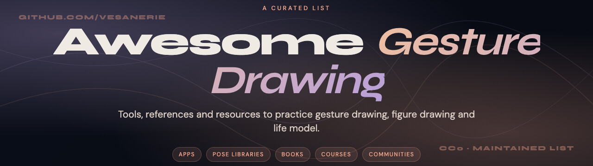

  

# Awesome Gesture Drawing 

> A curated list of tools, references and resources to practice gesture drawing, figure drawing and life model.

[Gesture drawing](https://en.wikipedia.org/wiki/Gesture_drawing) is the foundation of any artist's training : capturing the line of action, the movement and the energy of a pose in seconds. It is the discipline behind every illustrator, animator, concept artist and comic book penciller.

This list collects the best apps, pose libraries, books, courses, communities and references for daily practice : from absolute beginners to senior artists looking to sharpen their fundamentals.

Maintained by [Valentin Mardoukhaev](https://gesturo.fr), creator of [Gesturo](https://gesturo.fr). Contributions welcome via [pull requests](#contributing).

## Contents

- [Apps and Timers](#apps-and-timers)
- [Pose Reference Libraries](#pose-reference-libraries)
- [3D Pose Tools](#3d-pose-tools)
- [Books](#books)
- [Online Courses](#online-courses)
- [YouTube Channels](#youtube-channels)
- [Anatomy References](#anatomy-references)
- [Communities](#communities)
- [Drawing Hardware](#drawing-hardware)
- [Blogs and Articles](#blogs-and-articles)
- [Contributing](#contributing)

## Apps and Timers

Native, web and mobile apps to run timed gesture sessions with a curated photo catalog.

- [Gesturo](https://gesturo.fr) : modern native app for macOS, Windows, iOS and Android. 1,900+ photos of real models, precise timer 30s to 10min, animation and cinema modes, streak system, Discord community. Freemium.
- [Line of Action](https://line-of-action.com) : the classic web tool for figure, animal, hands and faces studies. Free, web only.
- [QuickPoses](https://www.quickposes.com) : minimalist web timer with curated photo packs. Free with optional Pro tier.
- [Croquis Cafe](https://croquiscafe.com) : long form video sessions by Onair Video, with real models and ambient music. Subscription.
- [SketchDaily Reference](https://artists.pixelovely.com) : Pixelovely's catalog with poses of every duration, categories include nude, clothed, hands, faces, animals, environments. Free, web only.
- [Posemaniacs](https://www.posemaniacs.com) : 3D figure poses you can rotate and study from any angle. Free.
- [Reference Angle](https://www.referenceangle.com) : pose finder organized by camera angle, useful for comic and concept artists. Free.

## Pose Reference Libraries

Photo libraries built specifically for artists.

- [SenshiStock](https://www.deviantart.com/senshistock) : thousands of action and dynamic poses on DeviantArt. Free with attribution.
- [PoseSpace](https://www.posespace.com) : photo packs by themes (figure, costumed, props). Paid.
- [Adorkastock](https://www.deviantart.com/adorkastock) : large catalog of free reference poses on DeviantArt.
- [Bodies in Motion](https://www.bodiesinmotion.photo) : high speed motion capture sequences for studying movement. Subscription.
- [The Drawing Database](https://www.thedrawingdatabase.com) : curated photo references for figure drawing.
- [Anatomy 360](https://anatomy360.info) : 3D scanned models with high resolution turntables. Paid.

## 3D Pose Tools

3D figure manipulation for hard to find angles.

- [DesignDoll](https://terawell.net) : poseable 3D mannequins with rotatable cameras, ideal for unusual angles.
- [Magic Poser](https://magicposer.com) : mobile 3D pose tool with props and lighting. Freemium.
- [Daz Studio](https://www.daz3d.com/daz_studio) : pro grade 3D figure software with photorealistic rendering. Free with paid asset packs.
- [Poser](https://www.posersoftware.com) : long running 3D character software. Paid.
- [PoseMy.Art](https://posemy.art) : browser based 3D poser, free.

## Books

Essential reading for figure drawing and anatomy.

- *Figure Drawing for All It's Worth* by Andrew Loomis : the classic, available free as PDF on the Internet Archive.
- *Constructive Anatomy* by George Bridgman : foundational study of the human form.
- *Force : Dynamic Life Drawing* by Michael Mattesi : the bible of dynamic gesture and movement.
- *Figure Drawing : Design and Invention* by Michael Hampton : structural and modern approach.
- *Vilppu Drawing Manual* by Glenn Vilppu : mass based approach, taught at Disney and Marvel.
- *Anatomy for Sculptors* by Uldis Zarins : visual surface anatomy, irreplaceable for forms.
- *Drawing the Human Body* by Andras Szunyoghy : encyclopedia of human anatomy.
- *Drawing on the Right Side of the Brain* by Betty Edwards : seeing fundamentals.
- *Successful Drawing* by Andrew Loomis : perspective and composition follow up to Figure Drawing.

## Online Courses

Structured curricula for figure drawing.

- [Proko : Figure Drawing Fundamentals](https://www.proko.com/courses/figure-drawing-fundamentals) : Stan Prokopenko's deep dive into figure construction.
- [New Masters Academy](https://www.nma.art) : library of figure drawing courses by working pro artists. Subscription.
- [Schoolism](https://www.schoolism.com) : courses by industry pros (Pixar, Disney, Nickelodeon). Subscription.
- [Watts Atelier Online](https://www.wattsatelier.com) : classical atelier training online. Subscription.
- [Glenn Vilppu Studio](https://vilppustudio.com) : courses and materials from Glenn Vilppu.
- [Marshall Vandruff](https://www.marshallart.com) : long form animation and figure drawing classes.
- [CG Master Academy](https://www.cgmasteracademy.com) : industry oriented figure and concept courses.

## YouTube Channels

Free tutorials and demos.

- [Proko](https://www.youtube.com/@ProkoTV) : the most popular figure drawing channel, Stan Prokopenko and guest experts.
- [Marco Bucci](https://www.youtube.com/@MarcoBucciOnline) : color, light and figure mini lessons.
- [Aaron Blaise](https://www.youtube.com/@AaronBlaiseArt) : former Disney animator, animal and figure drawing.
- [Sycra Yasin](https://www.youtube.com/@sycra) : long form thinking pieces on drawing fundamentals.
- [Sinix Design](https://www.youtube.com/@SinixDesign) : digital painting and figure construction.
- [Bobby Chiu](https://www.youtube.com/@chiustream) : illustration process and live drawing.
- [Drawing Tutorials Online](https://www.youtube.com/@drawingtutorialsonline) : Matt Laskowski's structured curriculum.
- [Michael Hampton](https://www.youtube.com/@MichaelHamptonArt) : author of the figure drawing textbook.
- [Krenz Cushart](https://www.youtube.com/@krenzart) : eastern style figure construction.
- [Sinix](https://www.youtube.com/@SinixDesign) : digital figure and design.

## Anatomy References

For deeper anatomical study.

- [Z-Anatomy](https://z-anatomy.com) : free open source 3D atlas of human anatomy.
- [Anatomy 360](https://anatomy360.info) : 3D scans with surface anatomy detail.
- [The Anatomy Page](https://anatomyforsculptors.com) : Uldis Zarins's online resources.
- [BioDigital Human](https://www.biodigital.com) : interactive 3D human body, free tier.
- [Visible Body](https://www.visiblebody.com) : medical grade anatomy for artists.

## Communities

Where artists share work, get feedback, and stay motivated.

- [r/learnart](https://www.reddit.com/r/learnart) : large beginner friendly community on Reddit.
- [r/ArtFundamentals](https://www.reddit.com/r/ArtFundamentals) : focused on Drawabox curriculum and fundamentals.
- [r/figuredrawing](https://www.reddit.com/r/figuredrawing) : dedicated to figure and gesture drawing.
- [r/conceptart](https://www.reddit.com/r/conceptart) : illustrators and concept artists.
- [r/dessin](https://www.reddit.com/r/dessin) : French speaking drawing community.
- [Gesturo Discord](https://discord.gg/f9pf3vmgg2) : Gesturo's community, daily challenges and shared work.
- [Drawabox Discord](https://drawabox.com/lesson/0/2/discord) : community around the Drawabox lessons.
- [Sycra forum](https://forum.sycra.net) : long running drawing community.

## Drawing Hardware

For digital practitioners.

- [Wacom](https://www.wacom.com) : the original pen tablet maker. Intuos line for beginners, Cintiq for pros.
- [iPad Pro + Apple Pencil](https://www.apple.com/shop/buy-ipad/ipad-pro) : the most popular portable setup with Procreate.
- [Huion](https://www.huion.com) : budget friendly tablets with screen options.
- [XP-Pen](https://www.xp-pen.com) : another solid budget tablet brand.
- [reMarkable](https://remarkable.com) : e-ink tablet for sketching without distraction.

## Blogs and Articles

Long form writing on drawing.

- [Gesturo Blog](https://gesturo.fr/blog) : articles on gesture drawing, figure drawing, and daily practice in French and English.
- [Muddy Colors](https://muddycolors.com) : essays by working illustrators and concept artists.
- [Concept Art World](https://conceptartworld.com) : industry news and process posts.
- [James Gurney's Blog](https://gurneyjourney.blogspot.com) : the *Color and Light* author writes daily about art.
- [Lines and Colors](https://www.linesandcolors.com) : profiles of historical and contemporary illustrators.

## Contributing

Found a tool, book, channel or community that belongs here ? Open a pull request.

Guidelines :
- The resource must be directly useful for gesture drawing, figure drawing or life model practice.
- Keep descriptions short and factual : what it is, who it is for, and whether it is free or paid.
- Submit a single resource per pull request to make review easier.
- Read the [Awesome contribution guidelines](https://github.com/sindresorhus/awesome/blob/main/contributing.md) before submitting.

## License

To the extent possible under law, [Valentin Mardoukhaev](https://gesturo.fr) has waived all copyright and related or neighboring rights to this work.
